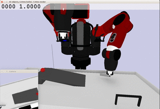
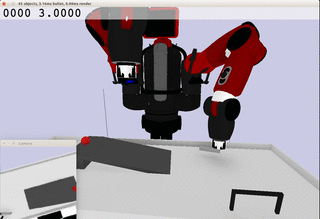

# roboschool_baxterstriker
Roboschool environment for baxter ball striking

## Dependencies:

Tensorflow (1.4)

[baxter_description](https://github.com/RethinkRobotics/baxter_common/tree/master/baxter_description)

[roboschool](https://github.com/openai/roboschool)

[gmr](https://github.com/navigator8972/gmr)

[vae_dyn](https://github.com/navigator8972/vae_dyn)

## Striking ball with internal model prediction when observation is off

